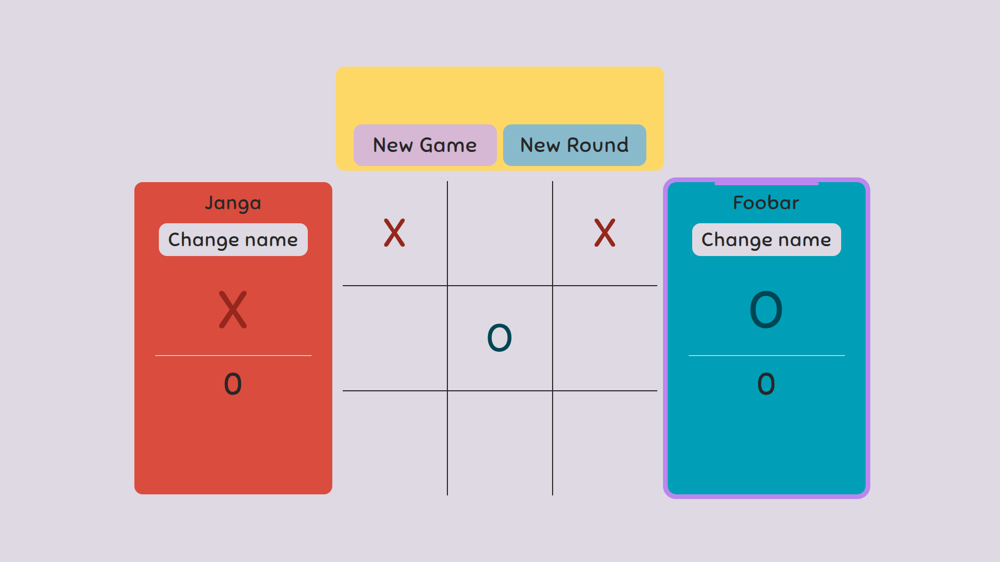

# tic-tac-toe
**Tic Tac Toe game made using HTML, CSS, and JavaScript**

## Page Preview 

## Main Features
- The ability to change players names
- An outline around current player's card indicating it's turn
- A score for each player
- A Top display that contains :
    - Text indicating the result upon the end of each round
    - New Game button : resets the entire game including scores
    - New Round button : resets current round without resetting scores

## Live Preview
[Live preview](https://abdulwhab-elghareeb.github.io/tic-tac-toe/)